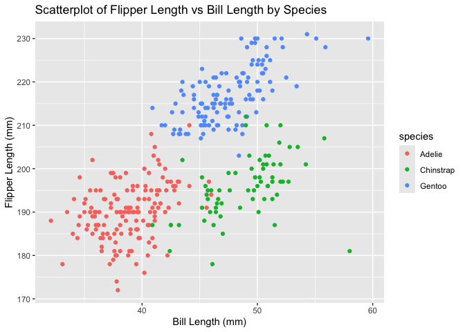

p8105_hw1_KAB2310
================
Kamiah Brown
2024-09-16

## This is my submission for Homework 1.

\##Set up

\#Problem 1 – \## I installed the package ‘palmerpenguins’ directly in
the console.

## R Markdown

``` r
data("penguins", package = "palmerpenguins")
nrow(penguins)
```

    ## [1] 344

``` r
ncol(penguins)
```

    ## [1] 8

``` r
mean(pull(penguins, flipper_length_mm), na.rm = TRUE)
```

    ## [1] 200.9152

The penguins data set has 344 observations and 8 variables. The
variables consist of the following: species, island, bill length, bill
depth, flipper length, body mass, sex and year. The size of dataset is
344 and 8 . The mean flipper length is 200.9152047.

## Creating Scatterplot of Flipper Length vs. Bill Length

\##Saving scatterplot of Bill Length (mm) vs Flipper Length (mm) –

``` r
ggplot(data = penguins, aes(x = bill_length_mm, y = flipper_length_mm, color = species)) +
  geom_point() +
  labs(x = "Bill Length (mm)", y = "Flipper Length (mm)", title = "Scatterplot of Flipper Length vs Bill Length by Species") 
```

    ## Warning: Removed 2 rows containing missing values or values outside the scale range
    ## (`geom_point()`).

<!-- -->

``` r
ggsave("ScatterplotofBillLength(mm)vsFlipperLength(mm).pdf", width = 7, height = 5)
```

    ## Warning: Removed 2 rows containing missing values or values outside the scale range
    ## (`geom_point()`).

\##Problem 2 –

``` r
df = tibble(
  random_samp = rnorm(10),
  logical_vector = random_samp > 0,
  character_vector = c("january","february", "march", "april", "may", "june", "july", "august", "september", "october"),
factor_vector = factor(c("Level 1", "Level 2", "Level 3", "Level 1", "Level 2", "Level 3", "Level 1", "Level 2", "Level 3", "Level 1")))
```

\##Mean of each variable

``` r
mean(pull(df, random_samp))
```

    ## [1] -0.3614976

``` r
mean(pull(df, logical_vector))
```

    ## [1] 0.5

``` r
mean(pull(df,character_vector))
```

    ## Warning in mean.default(pull(df, character_vector)): argument is not numeric or
    ## logical: returning NA

    ## [1] NA

``` r
mean(pull(df,factor_vector))
```

    ## Warning in mean.default(pull(df, factor_vector)): argument is not numeric or
    ## logical: returning NA

    ## [1] NA

The mean of the variable ‘random_samp’ is -0.3614976. I can not pull the
mean from variables ‘factor_vector’ or ‘character_vector’ because they
are categorical.

``` r
numeric_logical = as.numeric(pull(df, logical_vector))
numeric_character = as.numeric(pull(df, character_vector))
```

    ## Warning: NAs introduced by coercion

``` r
numeric_factor = as.numeric(pull(df, factor_vector))
```

The characters do not have a numeric value; R cannot assign numbers to
text therefore it shows as an error. This further proves why I am not
able to pull the mean from variables ‘character_vector’ or
‘factor_vector’. There is an error with logical_vector because it is
already in a numeric form. The ‘as.numeric’ function in R is used to
convert a character value into numeric value.
